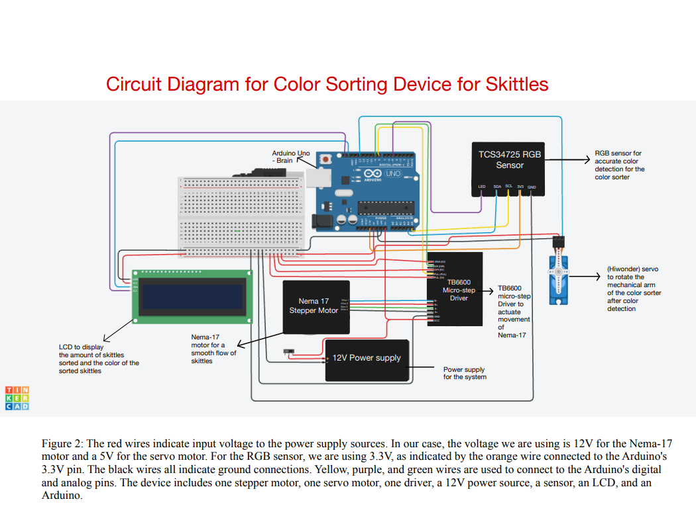
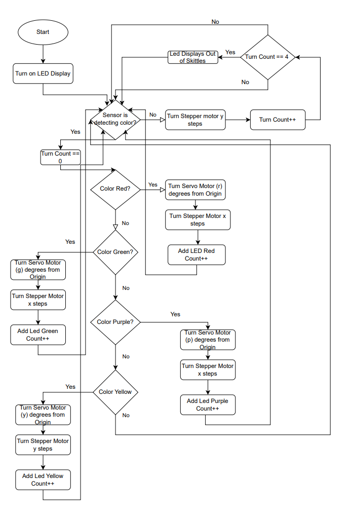
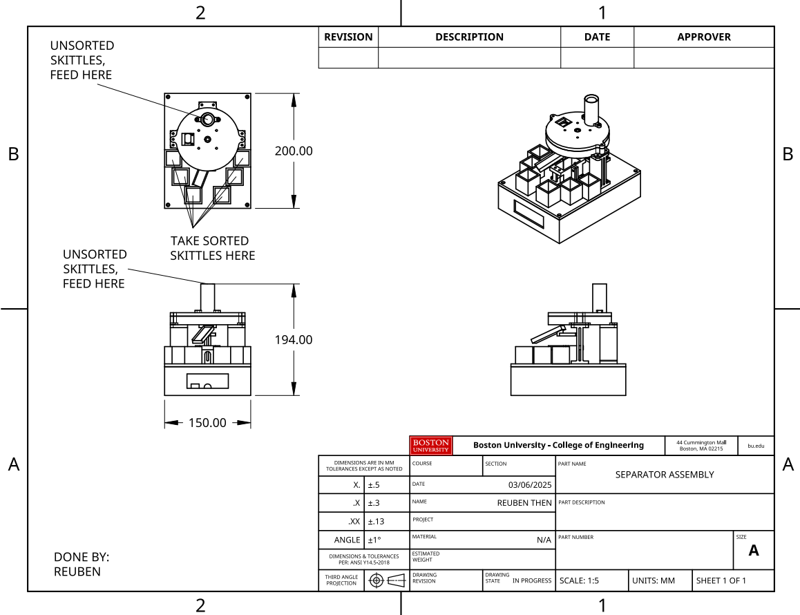

# ColorSorterProjectCode
EK210 color sorter project code

## Contributors

- **Hiwot Ayalew** — *Wiring diagram & circuit*
- **Owen Mulderig** — *CAD design and funnel system*
- **Ozan Ekame Pekgoz** — *Code & wiring of sensor and LCD*
- **Reuben Mishael Then** — *CAD design of main model & wiring for power supply & driver*

  
# Color Sorting (Arduino + TCS34725) — Code & Wiring

This repo contains **Arduino code and wiring** for a color-sorting device that uses an Adafruit **TCS34725** RGB sensor to detect color, an **SG90** servo to position a chute, and a **NEMA23** stepper (via driver) to rotate a bin disk. It excludes team mechanical/CAD files.

## Highlights
- Two sketches:
  - `firmware/ColorSensorMinimal.ino` — TCS34725 readout (R,G,B,C + Lux + CCT) to Serial.
  - `firmware/ColorSorter.ino` — sensor → classify → servo angle → stepper advance → LCD counters.
- Simple, reproducible **wiring** with common parts.
- **Cost breakdown** per part (see “Bill of Materials”).
- - Total parts cost: **$106**
  *( detailed prices in docs/bom.md.)*

## Hardware
- Arduino Uno (or compatible)
- Adafruit TCS34725 (I²C)
- Hiwonder HPS-2027 Servo
- NEMA17 stepper + driver (e.g., TB6600 or equivalent)
- 20×4 I²C LCD (addr `0x27` by default)
- 12 V PSU for stepper, 5 V for logic/servo, common ground

## Pinout / Wiring
- **TCS34725 (I²C):** SDA → A4, SCL → A5, VCC → 3.3 V, GND → GND  
- **Servo (SG90):** signal → D9, VCC → 5 V, GND → GND  
- **Stepper Driver (e.g., TB6600):** EN → D3, DIR → D2, STEP → D5; VMOT → 12 V; GND → GND; motor coils → A+/A−, B+/B−  
- **LCD 20×4 (I²C):** SDA → A4, SCL → A5, VCC → 5 V, GND → GND

> Pin numbers and I²C address are set in the sketches. Keep all grounds common. If the servo jitters, power it from a stable 5 V rail.

## Build & Run
1. Arduino IDE → **Library Manager**: install `Adafruit_TCS34725`, `Servo`, `LiquidCrystal_I2C` (and your stepper lib `mwc_stepper`).
2. Open a sketch in `firmware/` and **Upload** (Serial Monitor at 9600 baud).
3. For the sorter sketch, **tune thresholds** in code to match your lighting and candy batch.

## Calibration (Sorter)
1. Place one sample under the sensor; watch Serial for `R,G,B,C`.  
2. Adjust the threshold windows in `ColorSorter.ino` until each color classifies reliably.  
3. Re-test with a small batch; iterate.

## Bill of Materials (Per-Part Costs)
A detailed table is in `docs/bom.md`. It lists each component with a **price column** for you to fill with what *you* actually paid (Amazon/Adafruit/Local).  
- Typical total is ~\$100–\$120, but **replace the example numbers** with your own receipts.

## Notes
- `ColorSensorMinimal.ino` is a clean sensor readout only (no motion) — good for quick tests.
- `ColorSorter.ino` runs the full loop (sensor → classify → servo → stepper → LCD counters).  
- This repo intentionally focuses on **code + wiring** (my contribution). Mechanical/CAD assets are not included here.

## Gallery

